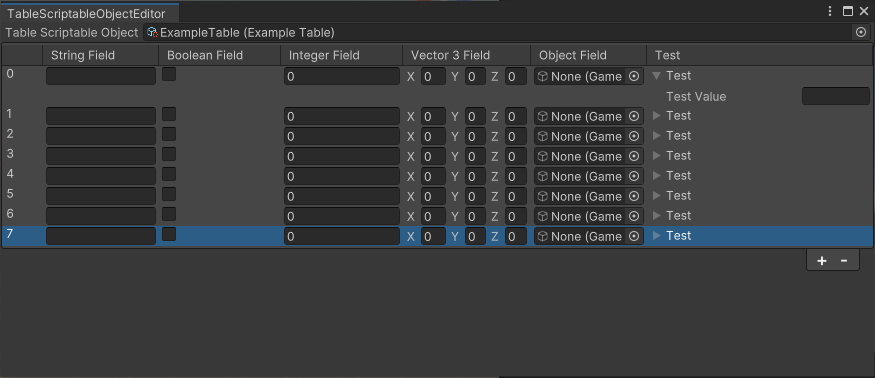

# TableScriptableObject
데이터 테이블 유형의 ScriptableObject 제네릭 클래스와 전용 테이블 에디터를 구현한 것입니다.
\
TableScriptableObject<T>의 닫힌 제네릭 클래스를 상속하여, 새로운 테이블 형식을 정의합니다.\
정의 예: `public class ExampleTable : TableScriptableObject<Data>`

유니티 에디터의 상단 메뉴바에서 Window/TableScriptableObject/TableScriptableObjectEditor 메뉴를 통해 에디터를 열 수 있습니다.\
에디터를 연 뒤, 에디터 상단의 ObjectField에 TableScriptableObject 에셋을 설정하는 것으로 테이블처럼 보면서 편집할 수 있습니다.

## ToDo 리스트
- 세로 스크롤 추가

## 유의 사항
ScriptableObjectEditor를 연채로 Inspector를 이용해 대상 ScriptableObject 에셋 내 목록의 요소의 수를 늘이거나 줄이면, 이는 ScriptableObjectEditor에 즉시 동기화되지 않습니다.\
ScriptableObjectEditor를 다시 열거나, ScriptableObjectEditor상에서 요소를 추가하면 그제서야 동기화됩니다.\
추후 개선하면 좋겠습니다만, 그렇지 않더라도 작업에 문제는 없어 보여서 개선할 예정은 없습니다.

## Unity6를 사용 중이라면
이 패키지를 사용할 필요가 없습니다.\
[Unity - Manual: MultiColumnListView](https://docs.unity3d.com/6000.0/Documentation/Manual/UIE-uxml-element-MultiColumnListView.html)에 이것보다 훨씬 쉽고 좋은 구현 예가 있습니다.\
2022.3 버전 기준으로 Column 클래스에 bindingPath 필드가 없어서 이렇게 구현할 필요가 있었습니다.

## 샘플
Package Manager에서 샘플 중 'UsageSample'을 임포트하여 테이블 샘플을 확인할 수 있습니다.

## 설치 방법
### 1. 설치
'Package Manager'의 좌상단의 '+' 버튼을 누르고, 'Add package from git URL'을 누르고, 다음 주소를 입력하세요.
`https://github.com/Feverfew826/TableScriptableObject.git?path=Assets/Plugins/TableScriptableObject`
